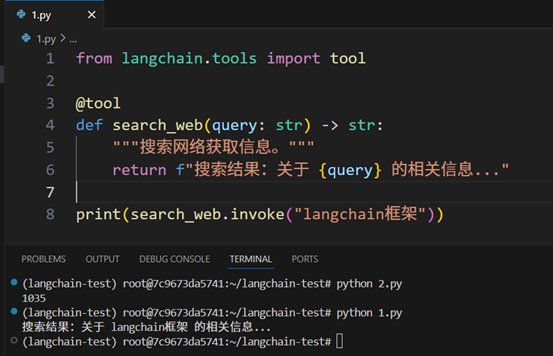
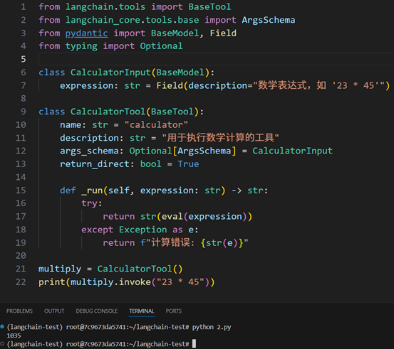
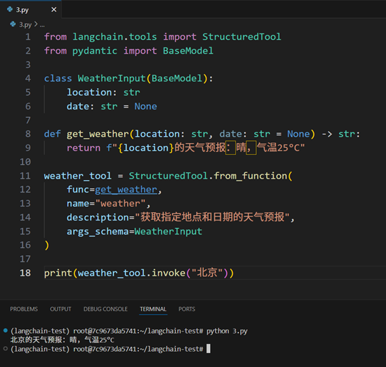
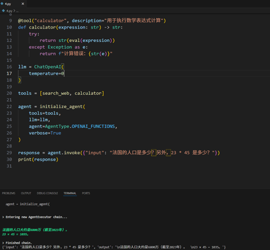
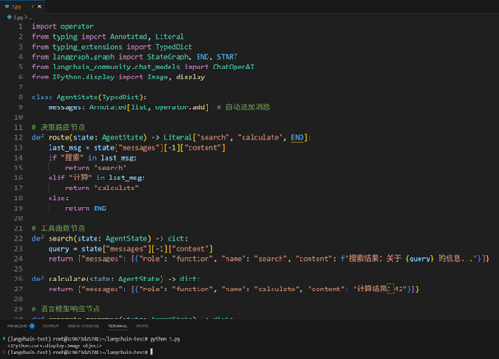
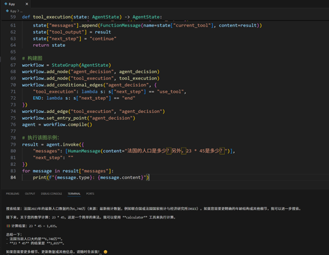

#第十张代码验证
#LangChain 工具与 LangGraph 工作流实践项目

本项目是《大语言模型系统工程理论与实践》第10章的实践代码，展示了如何使用 LangChain 框架创建自定义工具，以及如何使用 LangGraph 构建复杂的工作流。

## 📋 项目概述

本项目包含以下核心内容：
- **LangChain 工具开发**：从简单的装饰器工具到复杂的结构化工具
- **多工具代理**：集成多个工具创建智能代理
- **LangGraph 工作流**：构建基于图的工作流系统
- **决策工具集成**：实现智能工具选择和执行

## 🚀 快速开始

### 环境要求
- Python 3.8+
- OpenAI API Key（用于某些示例）

### 安装依赖

```bash
pip install -r requirements.txt
```

### 环境配置

在使用需要 OpenAI API 的示例前，请设置您的 API Key：

```bash
export OPENAI_API_KEY="your-api-key-here"
```

## 📁 项目结构

```
chapter10/
├── README.md                           # 项目说明文档
├── requirements.txt                    # 项目依赖
├── 10.3.1 decorator.py                 # 装饰器工具示例
├── 10.3.2 custom_tool.py              # 自定义工具类示例
├── 10.3.3 structured_tool.py          # 结构化工具示例
├── 10.3.4 multi_tool_agent.py         # 多工具代理示例
├── 10.3.5 langgraph_basic.py          # LangGraph 基础工作流
└── 10.3.6 langgraph_decision_tool.py  # LangGraph 决策工具工作流
```

## 🔧 示例详解

### 1. 装饰器工具 (10.3.1 decorator.py)

最简单的工具创建方式，使用 `@tool` 装饰器：

```python
from langchain.tools import tool

@tool
def search_web(query: str) -> str:
    """搜索网络获取信息。"""
    return f"搜索结果：关于 {query} 的相关信息..."
```

**特点**：
- 使用装饰器快速创建工具
- 自动生成工具描述和参数
- 适合简单的工具实现

### 2. 自定义工具类 (10.3.2 custom_tool.py)

继承 `BaseTool` 类创建更复杂的工具：

```python
from langchain.tools import BaseTool
from pydantic import BaseModel, Field

class CalculatorInput(BaseModel):
    expression: str = Field(description="数学表达式，如 '23 * 45'")

class CalculatorTool(BaseTool):
    name = "calculator"
    description = "用于执行数学计算的工具"
    args_schema = CalculatorInput

    def _run(self, expression: str) -> str:
        try:
            return str(eval(expression))
        except Exception as e:
            return f"计算错误: {str(e)}"
```

**特点**：
- 完整的类型定义和验证
- 自定义错误处理
- 更灵活的工具配置

### 3. 结构化工具 (10.3.3 structured_tool.py)

使用 Pydantic 模型定义结构化输入：

```python
from langchain.tools import StructuredTool
from pydantic import BaseModel

class WeatherInput(BaseModel):
    location: str
    date: str = None

def get_weather(location: str, date: str = None) -> str:
    return f"{location}的天气预报：晴，气温25°C"

weather_tool = StructuredTool.from_function(
    func=get_weather,
    name="weather",
    description="获取指定地点和日期的天气预报",
    args_schema=WeatherInput
)
```

**特点**：
- 强类型参数定义
- 自动参数验证
- 清晰的工具接口

### 4. 多工具代理 (10.3.4 multi_tool_agent.py)

集成多个工具创建智能代理：

```python
from langchain.agents import AgentType, initialize_agent
from langchain_community.chat_models import ChatOpenAI
from langchain.tools import tool

@tool("search_web", description="用于从网络搜索信息")
def search_web(query: str) -> str:
    return f"搜索结果：关于 {query} 的信息..."

@tool("calculator", description="用于执行数学表达式计算")
def calculator(expression: str) -> str:
    try:
        return str(eval(expression))
    except Exception as e:
        return f"计算错误：{str(e)}"

llm = ChatOpenAI(temperature=0)
tools = [search_web, calculator]

agent = initialize_agent(
    tools=tools,
    llm=llm,
    agent=AgentType.OPENAI_FUNCTIONS,
    verbose=True
)
```

**特点**：
- 自动工具选择
- 多步骤推理
- 自然语言交互

### 5. LangGraph 基础工作流 (10.3.5 langgraph_basic.py)

使用 LangGraph 构建基于图的工作流：

```python
from langgraph.graph import StateGraph, END, START

class AgentState(TypedDict):
    messages: Annotated[list, operator.add]

def route(state: AgentState) -> Literal["search", "calculate", END]:
    last_msg = state["messages"][-1]["content"]
    if "搜索" in last_msg:
        return "search"
    elif "计算" in last_msg:
        return "calculate"
    else:
        return END

workflow = StateGraph(AgentState)
workflow.add_node("route", route)
workflow.add_node("search", search)
workflow.add_node("calculate", calculate)
workflow.add_conditional_edges("route", route, {
    "search": "search",
    "calculate": "calculate",
    END: END,
})
```

**特点**：
- 可视化工作流图
- 条件分支逻辑
- 状态管理

### 6. LangGraph 决策工具工作流 (10.3.6 langgraph_decision_tool.py)

实现智能工具选择和执行的复杂工作流：

```python
def agent_decision(state: AgentState) -> AgentState:
    llm = ChatOpenAI(model="gpt-4-turbo")
    system_message = """你是一个智能助手，可以使用以下工具：
- search: 搜索网络获取信息
- calculator: 执行数学计算
分析用户意图，决定是否调用工具，或直接给出答案。"""
    # ... 决策逻辑
```

**特点**：
- 智能工具选择
- 多轮对话支持
- 复杂状态管理

## 🛠️ 运行示例

### 运行单个示例

```bash
# 运行装饰器工具示例
python 10.3.1 decorator.py
```



```bash
# 运行自定义工具示例
python 10.3.2 custom_tool.py
```



```bash
# 运行多工具代理示例
python 10.3.3 structured_tool.py
```



```bash
# 运行多工具代理示例
python 10.3.4 multi_tool_agent.py
```



### 运行 LangGraph 示例

```bash
# 运行基础工作流（会生成工作流图）
python 10.3.5 langgraph_basic.py
```



```bash
# 运行决策工具工作流
python 10.3.6 langgraph_decision_tool.py
```



## 📚 核心概念

### LangChain 工具
- **装饰器工具**：使用 `@tool` 装饰器快速创建
- **自定义工具类**：继承 `BaseTool` 实现复杂逻辑
- **结构化工具**：使用 Pydantic 模型定义接口

### LangGraph 工作流
- **状态图**：定义工作流的状态和转换
- **节点**：工作流中的处理单元
- **边**：节点之间的连接和条件
- **状态管理**：维护工作流执行状态

## 🔍 扩展建议

1. **添加新工具**：基于现有示例创建自定义工具
2. **优化工作流**：改进 LangGraph 工作流的决策逻辑
3. **集成外部 API**：连接真实的搜索、计算等服务
4. **错误处理**：增强异常处理和重试机制
5. **性能优化**：优化工具调用和工作流执行效率

## 📖 学习资源

- [LangChain 官方文档](https://python.langchain.com/)
- [LangGraph 官方文档](https://langchain-ai.github.io/langgraph/)
- [Pydantic 文档](https://docs.pydantic.dev/)

## 🤝 贡献

欢迎提交 Issue 和 Pull Request 来改进这个项目！

## �� 许可证

本项目仅供学习和研究使用。 
