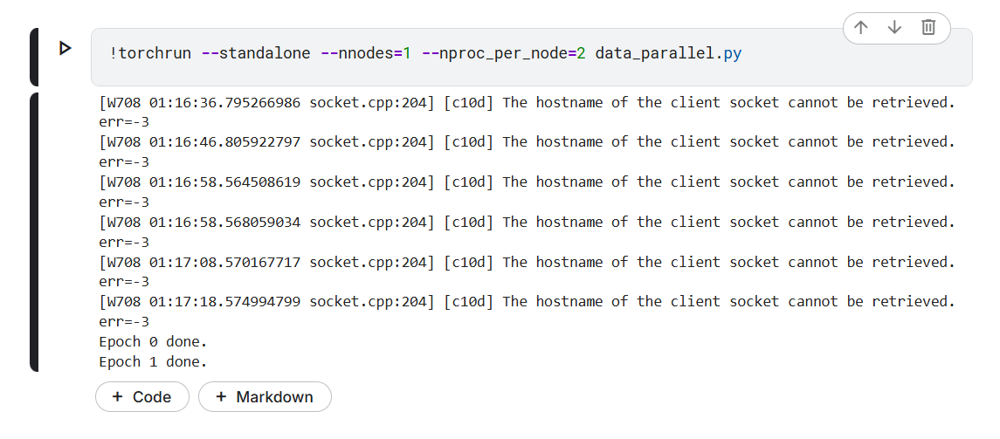
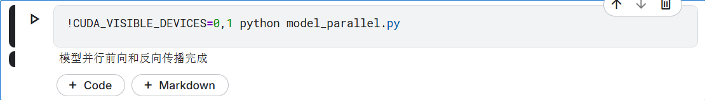
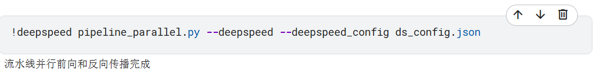
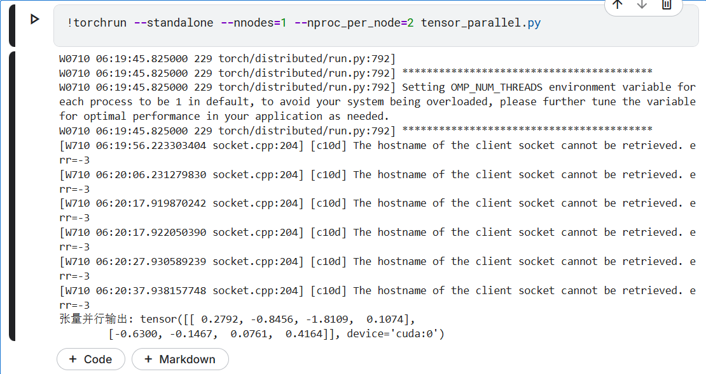
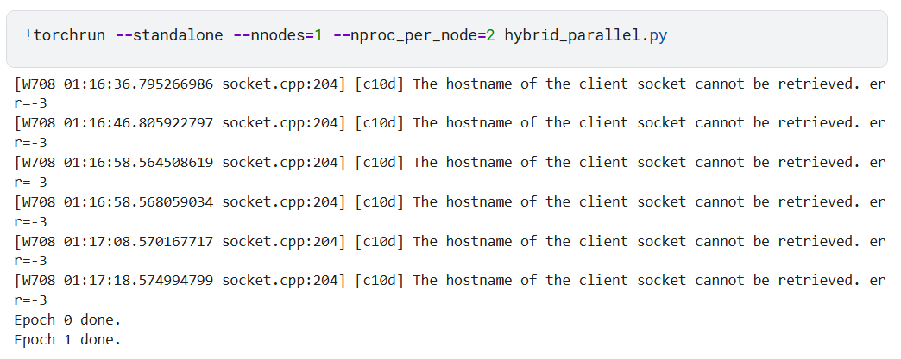

# 各类并行验证代码说明
data_parallel.py —— 数据并行（PyTorch DDP）
model_parallel.py —— 模型并行（模型不同部分在不同GPU）
pipeline_parallel.py —— 流水线并行（DeepSpeed PipelineModule）
tensor_parallel.py —— 张量并行（简化版，线性层输出多卡拼接）
hybrid_parallel.py —— 混合并行（数据并行+模型并行）
requirements.txt —— 依赖说明
readme.md —— 详细运行说明
## 依赖安装

建议使用conda或venv新环境：

```
pip install -r requirements.txt
```

## 1. 数据并行（data_parallel.py）
- 说明：使用PyTorch DDP实现，适合多卡。
- 运行方法：
```
torchrun --standalone --nnodes=1 --nproc_per_node=2 data_parallel.py
```



## 2. 模型并行（model_parallel.py）

- 说明：模型前后分布在不同GPU。
- 运行方法：
```
CUDA_VISIBLE_DEVICES=0,1 python model_parallel.py
```



## 3. 流水线并行（pipeline_parallel.py）

- 说明：使用DeepSpeed PipelineModule实现，2 stage。
- 运行方法：
```
deepespeed pipeline_parallel.py --deepspeed --deepspeed_config ds_config.json
```



## 4. 张量并行（tensor_parallel.py）

- 说明：简化版张量并行，线性层输出在多卡拼接。
- 运行方法：
```
torchrun --standalone --nnodes=1 --nproc_per_node=2 tensor_parallel.py
```



## 5. 混合并行（hybrid_parallel.py）

- 说明：数据并行+模型并行。
- 运行方法：
```
torchrun --standalone --nnodes=1 --nproc_per_node=2 hybrid_parallel.py
```



---

如需更复杂的张量/流水线/混合并行，可参考Megatron-LM等库。 