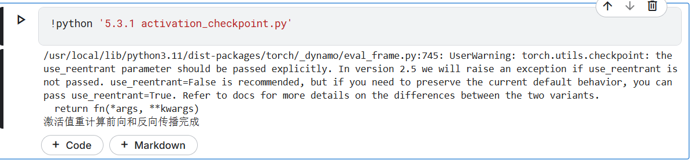
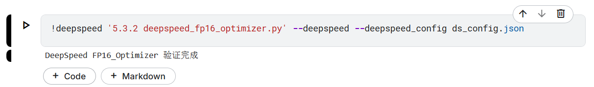
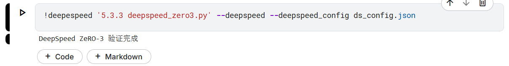
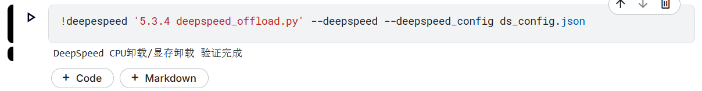

# 内存优化与激活值重计算验证代码说明
activation_checkpoint.py —— PyTorch激活值重计算（checkpoint）验证
deepspeed_fp16_optimizer.py —— DeepSpeed FP16_Optimizer 验证
bnb_8bit_optimizer.py —— bitsandbytes 8-bit Adam 验证
deepspeed_zero3.py —— DeepSpeed ZeRO-3 验证
deepspeed_offload.py —— DeepSpeed CPU卸载/NVMe卸载 验证（含两种配置文件）
custom_activation_offload.py —— 自定义激活值卸载（autograd.Function）
requirements.txt —— 依赖说明
readme.md —— 详细运行说明

## 依赖安装

建议新建虚拟环境后：
```
pip install -r requirements.txt
```

## 1. 激活值重计算（activation_checkpoint.py）
- 说明：PyTorch checkpoint功能，节省显存。
- 运行方法：
```
python '5.3.1 activation_checkpoint.py' 
```



## 2. DeepSpeed FP16_Optimizer（deepspeed_fp16_optimizer.py）

- 说明：使用DeepSpeed混合精度和FP16优化器。
- 运行方法：
```
deepespeed '5.3.2 deepspeed_fp16_optimizer.py' --deepspeed --deepspeed_config ds_config.json
```



## 3. DeepSpeed ZeRO-3（deepspeed_zero3.py）

- 说明：DeepSpeed ZeRO-3优化器，极致显存优化。
- 运行方法：
```
deepespeed '5.3.3 deepspeed_zero3.py' --deepspeed --deepspeed_config ds_config.json
```



## 4. DeepSpeed CPU卸载/NVMe卸载（deepspeed_offload.py）

- 说明：DeepSpeed显存卸载，支持CPU和NVMe两种配置。
- 运行方法：
```
deepespeed '5.3.4 deepspeed_offload.py' --deepspeed --deepspeed_config ds_config.json
# 或
deepespeed '5.3.4 deepspeed_offload.py' --deepspeed --deepspeed_config ds_config_nvme.json
```



---

如需更复杂的验证，可参考官方文档或进一步扩展。 