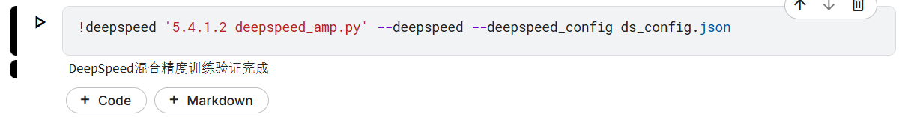
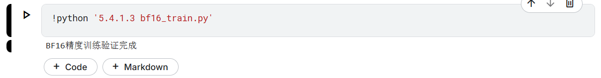
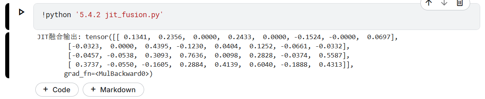
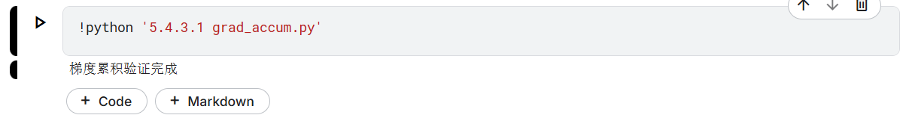
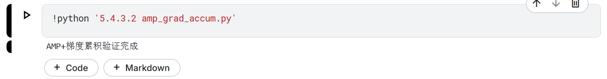
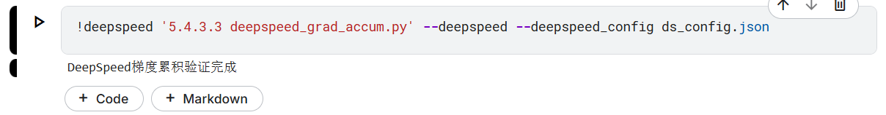
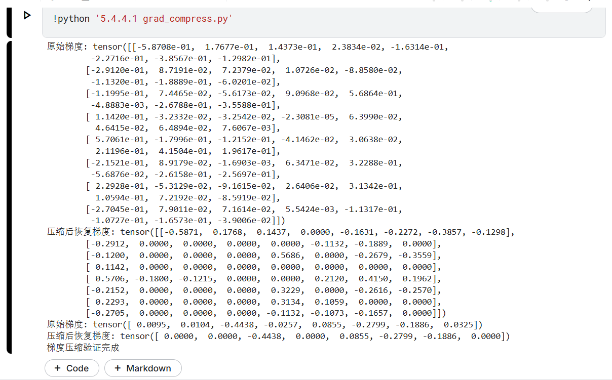
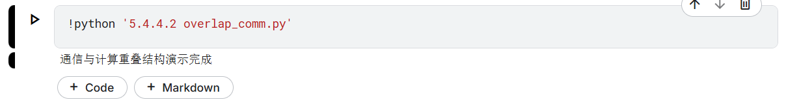

# 训练优化相关验证代码说明
amp_train.py —— PyTorch自动混合精度训练（AMP）
deepspeed_amp.py —— DeepSpeed混合精度训练
bf16_train.py —— PyTorch BF16精度训练
jit_fusion.py —— PyTorch JIT融合
grad_accum.py —— PyTorch梯度累积
amp_grad_accum.py —— AMP+梯度累积
deepspeed_grad_accum.py —— DeepSpeed梯度累积
grad_compress.py —— PyTorch梯度压缩（简化版）
overlap_comm.py —— PyTorch通信与计算重叠（结构演示）
deepspeed_comm_optim.py —— DeepSpeed通信优化
requirements.txt —— 依赖说明
readme.md —— 详细运行说明
## 依赖安装

建议新建虚拟环境后：
```
pip install -r requirements.txt
```

## 1. 混合精度训练
- amp_train.py —— PyTorch自动混合精度训练（AMP）


- deepspeed_amp.py —— DeepSpeed混合精度训练



- bf16_train.py —— PyTorch BF16精度训练



## 2. 算子融合
- jit_fusion.py —— PyTorch JIT融合



## 3. 梯度累积
- grad_accum.py —— PyTorch梯度累积



- amp_grad_accum.py —— AMP+梯度累积



- deepspeed_grad_accum.py —— DeepSpeed梯度累积



## 4. 通信优化
- grad_compress.py —— PyTorch梯度压缩（简化版）



- overlap_comm.py —— PyTorch通信与计算重叠（结构演示）



- deepspeed_comm_optim.py —— DeepSpeed通信优化


---

每个脚本头部有运行方法，部分DeepSpeed脚本需配合ds_config.json。
如需更复杂的验证，可参考官方文档或进一步扩展。 