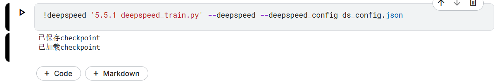

# DeepSpeed & Megatron-LM 框架实践验证代码说明

## 依赖安装

建议新建虚拟环境后：
```
pip install -r requirements.txt
```

## 1. DeepSpeed实践
- ds_config.json —— 典型DeepSpeed配置文件
- deepspeed_train.py —— DeepSpeed训练主流程验证代码
  - 运行方法：
    ```
    deepspeed deepspeed_train.py --deepspeed --deepspeed_config ds_config.json
    ```



## 2. Megatron-LM实践

- megatronlm_usage.md —— Megatron-LM实践命令与说明
  - 需源码安装，详见文档

---

如需更复杂的分布式/并行/混合精度/ZeRO等功能，可参考官方文档和本目录示例。 